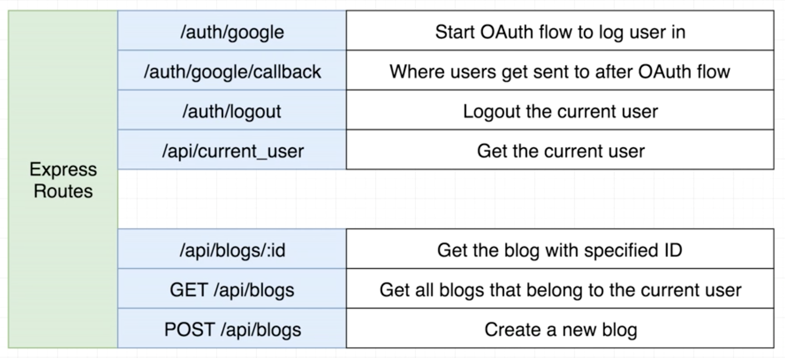

### Emaily

This application combines React, Redux, Express, and MongoDB technologies to build a full-stack web application.

#### What does it do?

This is a feedback-collection application that can be used by product owners. It comes with a full gamut of features including everything from authentication to email handling. It sends mass emails to a big list of users for the purpose of collecting feedback.

# Routes Walkthrough

The Express server of this application serves about seven different routes total. There is a section of routes all dedicated to authentication

There is an alternate application that was built with similar tools that not only have routes to handle authentication but also has routes to handle blog posts that will be available on Github soon.
